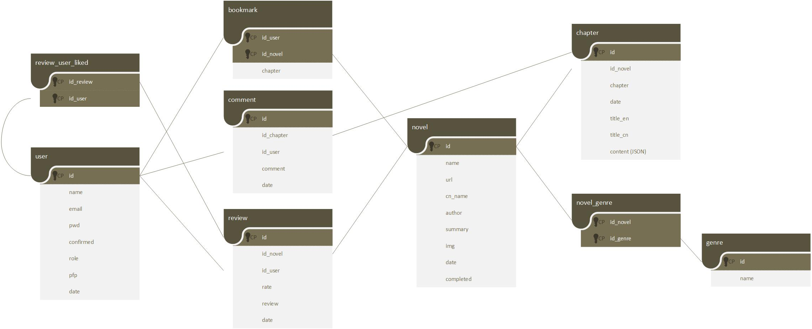

# MTL rust back

Using diesel with MariaDB and Actix Web

Data model:



## Install of the project

- Install of Rust
```
curl --proto '=https' --tlsv1.3 https://sh.rustup.rs -sSf | sh
```

- Install of Diesel CLI

Before installing the client, we have to install a database backend that will be used by the diesel client. For ou case it's mysql:

```
sudo apt-get install libmysqlclient-dev
```

Then you can install the diesel client just for mysql:

```
cargo install diesel_cli --no-default-features --features mysql
```

- If you get the Linker CC not found Error, do:

```
sudo apt install build-essential
```

- If on WSL, to get ip of host machine (for exemple to access it's db):

```
cat /etc/resolv.conf
```
